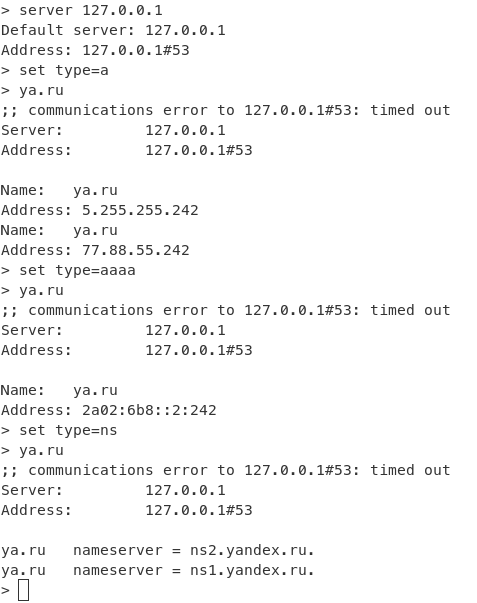

# Кэширующий DNS сервер

## Как работает данный сервер

1. Сервер ожидает DNS запросы от клиентов типа A, AAAA и NS.
2. Когда сервер получает запрос, он извлекает запрошенный домен из запроса.
3. Сервер проверяет наличие записи в кэше для данного домена.
4. Если запись присутствует в кэше и еще не истек срок ее жизни, сервер возвращает ответ клиенту на основе кэшированной записи.
5. Если запись отсутствует в кэше или истек срок ее жизни, сервер отправляет запрос на резолвер верхнего уровня (например, публичные DNS серверы), чтобы получить актуальные данные.
6. Полученный ответ от резолвера верхнего уровня сохраняется в кэше и отправляется клиенту.

## Настройка сервера

Перед запуском необходимо настроить сервер в `config.json`.

| Наименование параметра  | Описание | Значение по умолчанию |
| --- | --- |------------------|
| `root_server_ip` | IP-адрес корневого DNS сервера | 192.168.3.1      |
| `root_server_port` | Порт корневого DNS сервера | 53               |
| `server_ip` | IP-адрес кэширующего DNS сервера | 127.0.0.1        |
| `server_port` | Порт кэширующего DNS сервера | 53               |
| `request_size` | Максимальный размер DNS запроса в байтах | 1024             |
| `cache_filepath` | Путь к файлу, в котором будет храниться кэш DNS записей | "./cache"   |
| `clean_period` | Периодичность очистки устаревших записей из кэша в секундах | 3600             |

## Пример запуска сервера

```bash
python main.py
```


