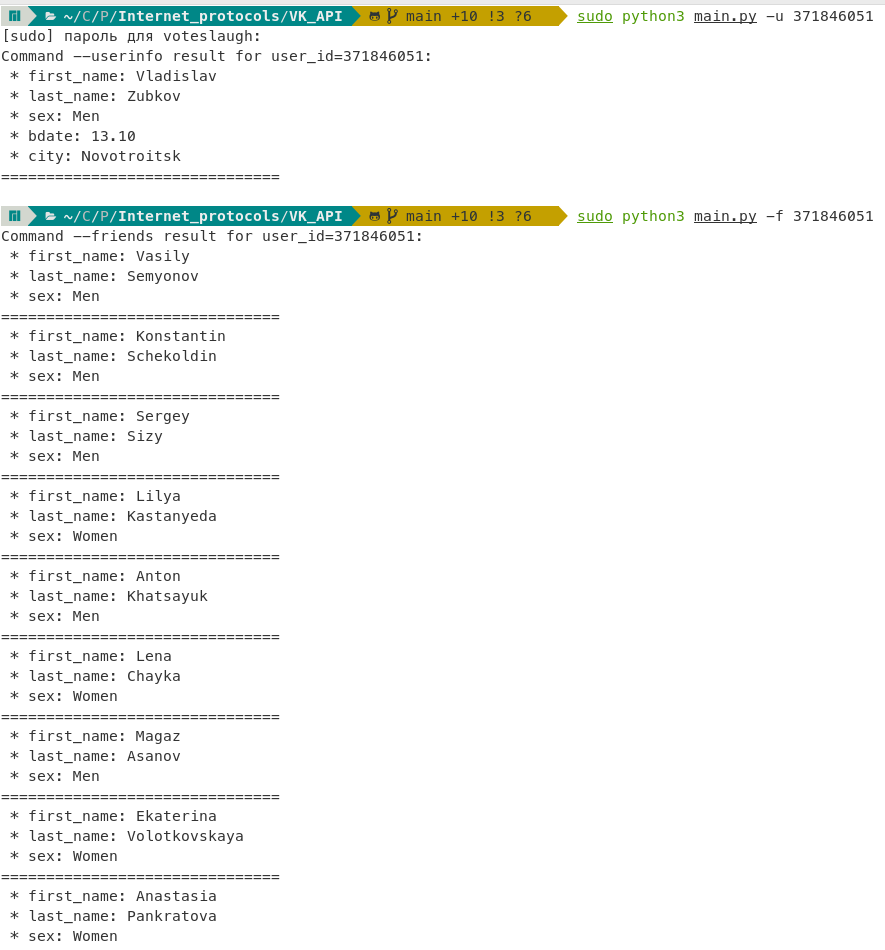

# VK API

Простой клиент для VK API: https://dev.vk.com/reference

## Как работает

Для работы приложения нужен Ваш token в `settings.json`: 
https://dev.vk.com/api/access-token/getting-started

### Команды, предоставляемые приложением:
```bash
python3 main.py -h
```

### Пример запуска
```
python3 main.py -u 371846051
```

